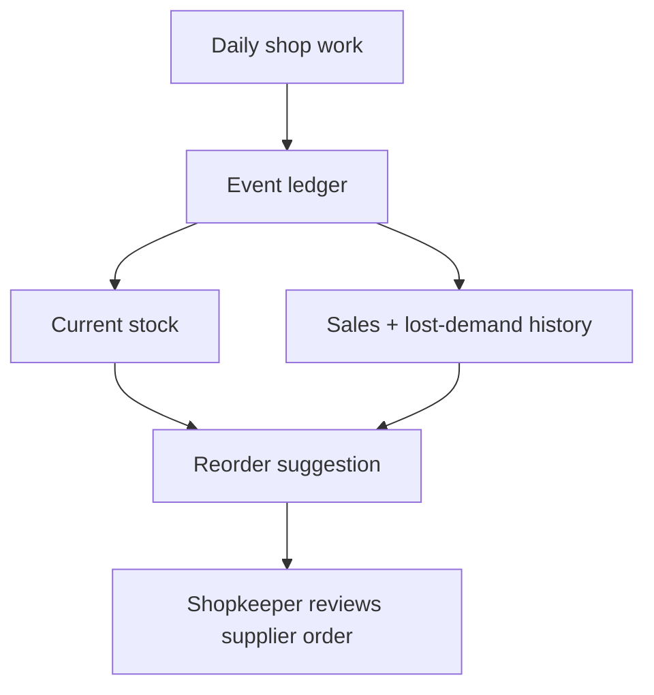
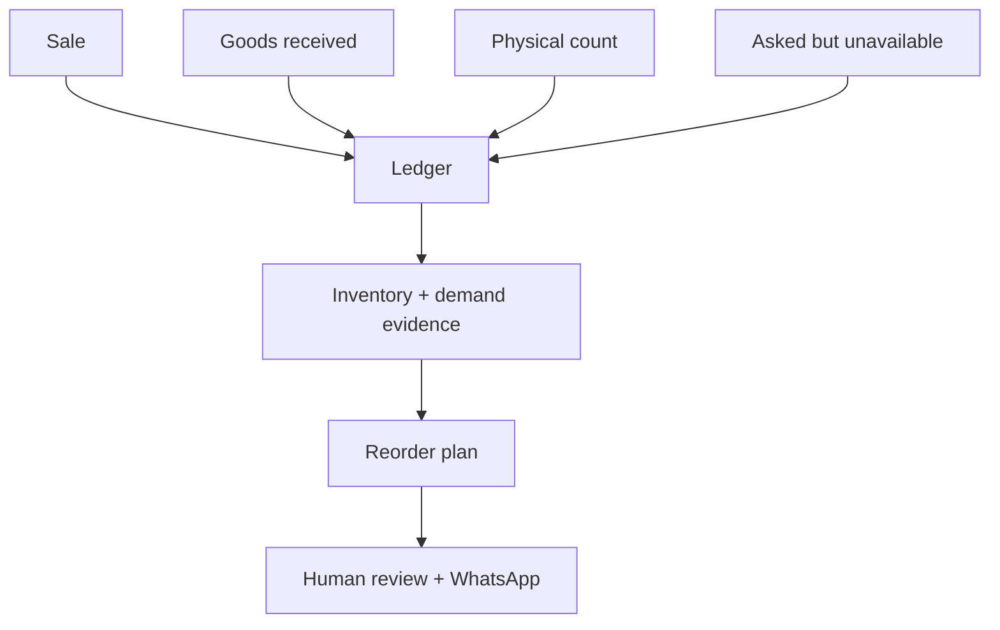

# DukaanSaathi — Kirana Operations Pilot

**A local-first daily operations prototype for independent kirana shops: sales and billing, inventory ledger, udhaar, stock counting, supplier ordering and lightweight replenishment suggestions in one browser app.**

This project asks a different question from a supply-chain analytics engine:

> Can a small shop record ordinary work once, keep a usable stock ledger, and turn that same daily data into simple actions?

## The idea in one picture



The transaction record is the centre of the design. A sale reduces stock; a receipt increases it; a physical count reconciles it. The same evidence can then support reorder suggestions instead of asking the shopkeeper to maintain a second analytics system.

## What a shopkeeper can do now

| Daily job | What DukaanSaathi does |
|---|---|
| Sell goods | Cart checkout or one-tap quick sale |
| Make a bill | Saves bills, supports cash/UPI labels, print and WhatsApp text |
| Track stock | Derives stock from opening, sale, receipt and count events |
| Correct stock | Physical-count reconciliation with difference shown |
| Record stockouts | “Asked, none” records observed lost demand |
| Manage udhaar | Customer balances, credit/payment history and WhatsApp reminder |
| Decide what to order | Lightweight demand estimate + stock/lead-time/pack-size reorder rule |
| Contact suppliers | Groups items by supplier and opens a reviewed WhatsApp order |
| Receive goods | Receipt event updates the stock ledger |
| Protect local data | JSON backup, restore and event-ID-based merge |
| Run a field trial | Exports a small usage/trial report and accepts feedback notes |
| Use Hindi | English/Hindi interface toggle |

## Operations and supply-chain concepts used

| Concept | How it appears in this prototype | Operational purpose |
|---|---|---|
| **Perpetual inventory / event ledger** | Stock is derived from stock-changing events rather than stored as an isolated editable truth. | Connects selling and receiving to the quantity shown on hand. |
| **Inventory record accuracy** | Old or contradictory inventory evidence is flagged; physical count reconciles the record. | Reminds the user that a computed stock number still needs periodic physical verification. |
| **Demand estimation** | Up to 28 days of usable history feeds candidate naive, moving-average and simple exponential-smoothing forecasts. | Provides an evidence-based daily demand rate for the reorder rule. |
| **Forecast evaluation** | Candidate methods are compared on historical one-step errors using a weighted absolute-error ratio. | Avoids permanently choosing one forecasting rule for every SKU. |
| **Stockout-censored demand** | Days with no stock are not automatically treated as normal zero-demand days; explicitly recorded lost demand can contribute. | Reduces one common source of downward demand bias. |
| **Lead-time-aware replenishment** | Reorder trigger and target depend on estimated demand, supplier lead time and minimum stock. | Recognises that stock must cover the wait for replenishment. |
| **Pack-size constraint** | Suggested quantity is rounded to a product's ordering multiple. | Produces suggestions closer to quantities a supplier can actually ship. |
| **Days of cover** | On-hand stock is divided by estimated daily demand. | Gives the shopkeeper a simple indication of how long stock may last. |
| **Supplier grouping** | Replenishment lines are grouped by supplier before the WhatsApp hand-off. | Turns SKU-level needs into a supplier-facing task. |
| **Human-in-the-loop ordering** | Suggested quantities remain editable before any WhatsApp message is opened. | A model suggestion does not silently become an order. |

## From shop action to useful information



## Where the data goes

The current prototype is **local-first**. Shop data is saved in the browser's `localStorage` on that device. It is not silently uploaded to a server.

The shopkeeper can download a JSON backup, restore one, or merge records from another exported backup. This is useful for a controlled pilot, but it is **not cloud synchronization** and should not be represented as one.

## Important boundary versus Project A

**DukaanSaathi** is the shopkeeper-facing operational prototype. It focuses on capturing real daily activity and keeping the shop's working records together.

The separate **KiranaFlow Replenishment Pilot** is the deeper supply-chain decision-support project with stricter analytical modules, inventory policy, exception gates and constrained network allocation. The two projects are complementary, not duplicate versions of the same app.

## Run it

No installation is required for the prototype. Download `index.html` and open it in a modern browser.

For repository checks:

```bash
npm test
```

## Start with sample data

1. Open `index.html`.
2. Tap **Load sample items**.
3. Try **Sell**, **Stock**, **Order** and **Udhaar**.
4. Open **Settings** to change shop details or download a backup.

Then read the [plain-language user manual](docs/USER-MANUAL.md).

## What is not production-ready

- no user accounts or production authentication;
- no hosted/cloud database or automatic multi-device synchronization;
- no direct POS, accounting or distributor API integration;
- no barcode scanner/catalogue import workflow;
- no automatic handwriting OCR;
- no calibrated probabilistic safety-stock/service-level model;
- no field evidence yet that the reorder suggestion improves availability or profit;
- printed GST output is a prototype feature, **not a claim of tax/GST compliance**;
- browser storage can be cleared by the user/device, so backups matter.

See [architecture and boundaries](docs/ARCHITECTURE.md) and the [field-pilot guide](docs/PILOT-GUIDE.md).

## Evidence standard

The included repository checks establish that the single-file application contains the expected operational paths and that its JavaScript parses. They do not establish commercial reliability or real-world business impact. Those require a shop pilot, observed data and agreed measures.
