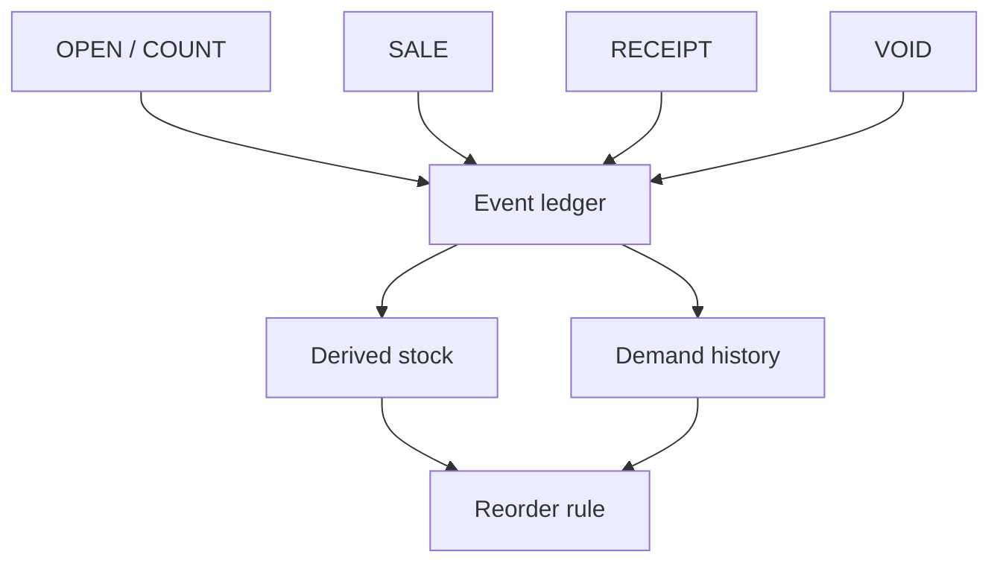

# Architecture and boundaries

## Core data model

DukaanSaathi uses a local event ledger. Product stock shown on screen is derived from stock-changing events.

`LOST` events capture an observed request that could not be sold; they affect demand evidence but not physical stock. `CREDIT` and `PAYMENT` events support customer balances. `BILL` records group sales into a bill.

## Demand/reorder mechanism

For an SKU, the prototype examines up to 28 recent days. Stockout-censored days are excluded unless explicit lost demand was recorded. With enough usable history, it compares naive, 3/7-day moving average and simple exponential-smoothing candidates using historical one-step forecast errors. With little history it falls back to simpler averages/minimum-stock logic and exposes lower confidence.

The replenishment rule uses estimated daily demand, supplier lead time, configured minimum stock and pack multiple. It creates an editable suggestion, not an executed order.

This mechanism is intentionally lighter than the separate KiranaFlow analytical engine. It should be treated as a pilot heuristic until field data establish where it works and where it fails.

## Data storage

- Working state: browser `localStorage` under a DukaanSaathi-specific key.
- Backup: user-triggered JSON download.
- Restore: replaces local working state from a selected JSON file after basic structure checking.
- Merge: adds unseen event/product/customer IDs from another backup.
- Network: WhatsApp links are opened only for user-reviewed messages; there is no application server or distributor synchronization.

## Important invariants and boundaries

- A sale and a lost sale are different facts.
- Sending a supplier message and receiving the goods are different events.
- Voiding an event preserves an audit event rather than silently rewriting the original event.
- Derived stock is clamped at zero for display; a negative raw result makes the inventory state stale and signals a data problem.
- Physical count is the reconciliation mechanism for inventory drift.
- Forecast/reorder output is advisory.
- Local browser persistence is not a cloud backup.
- Backup merge is not production multi-device synchronization.
- Estimated profit is not a financial statement.
- Prototype invoice output is not evidence of GST compliance.
