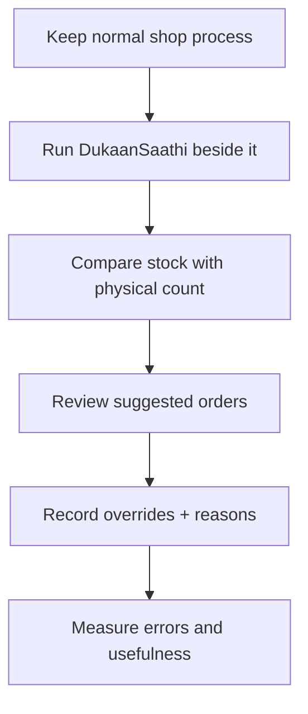

# Field-pilot guide

The first real test should be small: one willing shop, a limited product set, and an agreed trial period. Do not begin by replacing the shop's existing records.

## Before the pilot

Ask the shopkeeper:

1. How are sales recorded today?
2. How do you know current stock?
3. How often do you physically count it?
4. How do you decide what to reorder?
5. How do you contact suppliers?
6. How long do important suppliers normally take?
7. Do suppliers require cartons/pack multiples?
8. How is udhaar recorded and collected?
9. Which 20–50 products are worth testing first?
10. What would make this app too slow or annoying to use every day?

## Safe pilot flow

The existing shop system remains the source of business continuity during the pilot. DukaanSaathi should first run beside it, not overwrite or corrupt it.

## Evidence worth collecting

- number of active pilot days;
- sales/receipts/counts actually recorded;
- physical stock vs app stock;
- how often suggestions were accepted or changed;
- reason for changing a suggestion;
- observed stockout/lost-demand events;
- actual supplier lead times where observable;
- time/effort required from the shopkeeper;
- usability complaints and missing workflows.

Do not claim percentage improvement in stockouts, profit or forecast accuracy until the trial design and observations can support that claim.
