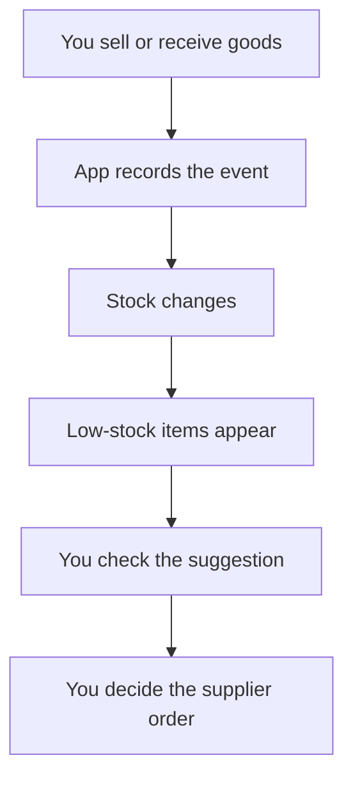

# DukaanSaathi user manual

This guide is for a shopkeeper. You do not need to know computers or supply-chain terminology.

## What problem does it solve?

The same shop activity is often written in several places: a sale here, stock in another book, customer credit somewhere else, and a supplier order on WhatsApp.

DukaanSaathi tries to join those daily jobs so one action can also keep the stock record useful.

## First day: set up the shop

Open **Settings** and enter the shop name. Address/phone and GSTIN are optional prototype fields. Choose English or Hindi.

Then add products. For each product, enter what you actually know:

- name and unit;
- selling price and cost price;
- current physical quantity;
- minimum stock;
- normal supplier lead time;
- order pack/multiple;
- supplier name and WhatsApp number.

If you only want to learn the app, tap **Load sample items** instead.

## Every sale

Open **Sell** → search the item → add the quantity → checkout.

When the bill is saved, the sale becomes part of the ledger and stock falls. If you use **Quick sell**, one tap records a one-unit sale without creating a bill.

If somebody asks for an item and you do not have it, tap **Asked, none**. This is not a sale. It records evidence that demand existed while stock was unavailable.

## When goods arrive

Open **Stock** → find the product → **Receive** → enter the received quantity.

The receipt increases the stock ledger.

## When the shelf and app disagree

Open **Stock** → **Count** → enter what you physically counted.

The app shows the difference and makes the physical count the new stock reference. Do this carefully: a count is evidence, not a guess.

## When it is time to reorder

Open **Order**.

Items are grouped by supplier. Some quantities are pre-filled when the rule thinks stock is low. Check every quantity. You may change it.

Tap **Send on WhatsApp** only after you are satisfied. The app opens a prepared message; you remain responsible for sending/confirming the actual order with the supplier.

When goods really arrive, record the receipt. Do not mark goods received simply because an order was sent.

## Udhaar

Open **Udhaar** → add customer → enter an amount under that customer.

- **Gave credit** means the customer now owes more.
- **Got paid** means the customer paid money back.
- Tap the customer name to see history.
- **Remind** prepares a WhatsApp reminder when a phone number exists.

## Backup

Open **Settings** → **Download backup**.

Keep the downloaded JSON file somewhere safe. The current app saves its normal working data inside that browser on that device. Clearing browser/site data can remove it.

**Restore backup** replaces the working state with the chosen backup. **Merge from another device** adds previously unseen event/product/customer IDs. For a real multi-device deployment this mechanism needs stronger conflict handling and identity controls.

## What the Home screen means

- **Sales today**: value of recorded sale events today.
- **Est. profit**: selling price minus stored cost price for recorded sales; it is an estimate, not accounting profit.
- **Low stock**: products currently triggering the prototype reorder rule.
- **Stock value**: current derived stock × stored cost price.
- **Needs reorder**: items the rule asks you to review.
- **to collect**: positive recorded customer udhaar balances.

## Five questions before trusting a suggestion

1. Is the stock quantity on screen close to the shelf count?
2. Have recent sales actually been recorded?
3. Did customers ask for the item while it was out of stock?
4. Is the supplier lead time still realistic?
5. Is today unusual because of a festival, promotion, closure or local event?

If the evidence is wrong, correct the evidence first. Do not trust a neat number merely because the computer produced it.
